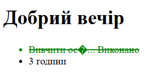

# Лабораторна робота №4
**Тема:** Форматування даних власними функціями  
**Мета:** Навчитися створювати власні функції для обробки тексту та локалізації дати, зрозуміти принципи DRY та область видимості змінних.  
**Технології:** PHP, функції роботи з рядками, синтаксис `function`

## Код програми

```php
<?php
function formatTitle($text, $maxLength = 20) {
    if (strlen($text) > $maxLength) {
        return substr($text, 0, $maxLength) . "...";
    }
    return $text;
}
function getCurrentGreeting() {
    $hour = date('H');
    if ($hour >= 6 && $hour < 12) {
        return "Доброго ранку";
    } elseif ($hour >= 12 && $hour < 18) {
        return "Добрий день";
    } elseif ($hour >= 18 && $hour < 24) {
        return "Добрий вечір";
    } else {
        return "Доброї ночі";
    }
}
$taskTitle = "Вивчити основи PHP та створення власних функцій для форматування даних";
?>

<header>
    <h1><?= getCurrentGreeting() ?></h1>
</header>

<main>
    <ul>
        <li class="<?= $isCompleted ? 'task-done' : 'task-pending' ?>">
            <?= formatTitle($taskTitle) ?>
            <?php if ($isCompleted): ?>
                Виконано
            <?php else: ?>
                В процесі
            <?php endif; ?>
        </li>
        <li><?= $taskTimeEstimate ?> години</li>
    </ul>
</main>

